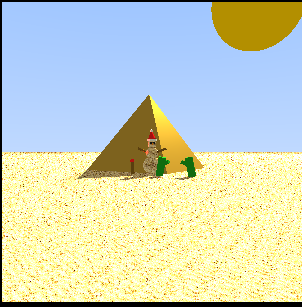

# CG Ray Tracing Fundamentals

A 3D ray casting and rendering engine developed in Python for the Computer Graphics course. 
It renders a thematically coherent scene strictly within the first octant, implementing various geometric primitives, transformations, lighting models, and camera projections.

## 📸 Final Render (300x300+)


## ✨ Features Implemented

### 1. Scene & Objects
- [x] **Coherent Theme:** The scene features a 'Christmas in the Desert' theme, showcasing a festive sandman with a Santa hat standing near a pyramid and cacti under a bright sun. All objects are mathematically positioned in the first octant (x, y, z > 0).
- [x] **Primitives:** Sphere, Cylinder, Cone, and 3D Mesh.
- [x] **Materials & Textures:** 4 distinct materials and texture mapping applied.

### 2. Transformations
- [x] Translation, Scaling, and Rotation (axis-aligned and arbitrary axis via Quaternions.
- [x] **Bonus:** Shearing and Reflection across an arbitrary plane.

### 3. Lighting & Shadows
- [x] **Light Sources:** Ambient, Point light, Directional, and Spot light.
- [x] **Shadows:** Hard shadows implemented via ray casting.

### 4. Camera & Projections
- [x] Custom Eye, At, and Up vectors with adjustable focal length ($d$) and Field of View (window coordinates).
- [x] **Projections:** Perspective (with zoom in/out), Orthographic, and Oblique.
- [x] **Vanishing Points:** Configured camera settings to demonstrate 1, 2, and 3 vanishing points.

### 5. Interactivity
- [x] Object Pick function.

## 🚀 How to Run

1. Clone the repository:
```bash
git clone [https://github.com/Ruan-h/CG-Ray-Tracing-Fundamentals.git](https://github.com/Ruan-h/CG-Ray-Tracing-Fundamentals.git)
```
2. Install dependencies:
```bash
pip install -r requirements.txt
```
3. python main.py
```bash
python src/main.py
```

## 🎬 Scenarios & Camera Configurations

The rendering engine includes a built-in scenario selector to demonstrate all required projection types, zooming capabilities, and vanishing points. 

To render a specific setup, edit the `cenarios_para_rodar` list in the `main()` function inside `src/main.py`:

```python
def main():
    # Change the IDs here to render different scenarios
    cenarios_para_rodar = [1, 4, 5, 7] 
    for id_teste in cenarios_para_rodar:
        rodar_cenario(id_teste)
